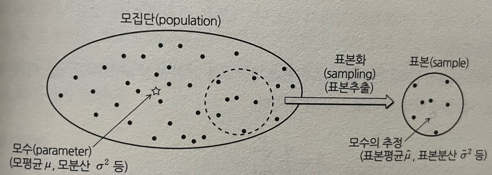

# 데이터 사이언스 교과서

통계(statistic) - 표본을 조사함으로써 모집단의 성질을 명확히 하는 것을 목적으로 하고 개개의 요소를 표본화(샘플링, smapling)하여  
    이것을 분석하고 모집단의 성질을 수량적으로 나타내는 것.

## 1. 통계란

**모집단**(population)의 특징을 나타내는 것이 **모수**(parameter)  
모수는 **모평균**(population mean) μ, **모분산**(population variance) σ2 등 몇 개의 후보가 있음.  

**표본화**(sampling, 표본추출, 샘플링) - 모집단 모두를 아는 것이 불가능한 경우, 이것으로부터 요소를 몇 가지 추출.  
**표본**(sample) - 표본화를 통해 얻어진 것.

**통계**(통계분석) - 이 표본에 대해서 어떠한 분석을 수행하여 모수를 추정하는 것.  
**통계량**(statistic) - 표본으로부터 계산된 수치(표본평균, 표본분산, 표본표준편차 등)

---
---
## 2. 추정
**통계적 추정**(statistical inference) - 표본으로부터 얻어진 통계량을 기초로 모수가 존재하는 범위를 구하는 것.  
1. 점추정 - '모평균이 0.125다'라는 식으로 하나의 값을 추정하는 것.
2. 구간추정 - '모평균은 0.1230과 0.130 사이에 있다.'라는 식으로 범위를 추정하는 것.

### 2.1 점추정(point estimation)
-모집단의 모수를 하나의 값으로 추정하는 방법.

- **불편성** - 추정량[hat(θ)]의 기댓값이 모수 θ에 일치하는 것.  
즉 E[hat(θ)] = θ가 성립할 때 추정량 hat(θ)를 **불편추정량**(unbiased estimator)라고 부른다.  

불편성을 가질 때 θ의 주변에 hat(θ)가 분포한다.  
[실습](https://github.com/Jung-YongHan/Data-Engineering/blob/main/DataScienceTextBook/Part%204_%ED%86%B5%EA%B3%84%EC%9D%98%20%EA%B8%B0%EC%B4%88/practice/practice1.ipynb)

#### **표본분산의 자유도**  
**자유도**(degree of freedom, DoF) - 몇 개의 변수를 마음대로(자유롭게) 움직여도 되는가를 측정하는 지표.   
ex) 표본 $\{x_i\}, (i = 1$ ~ $N)$에 대해, N=1이라고 해도, 표본 평균은 계산할 수 있다.  
즉, N개의 표본을 자유롭게 할 수 있으면 자유도를 N이라고 한다.  

표본분산의 계산식을 생각하면 N = 1에서는 표본분산은 0이 되고 의미를 가지지 않는다.  
최소한 N $\ge$ 2이면, 표본분산은 계산할 수 있다.  
따라서 표본수 중의 하나는 자유롭게 사용할 수 없다. 이 때문에 표본분산의 자유도는 N-1이라고 간주.

#### **일치성**
표본의 수가 증가함에 따라 추정량 hat(θ)에 대응하는 모수에 가까워 지는 것이 바람직.   
이 성질을 나타내는 식,

$\lim_{N \to \infty} P(|\hat{θ}_N - θ| < ε) = 1$  

$N \to \infty$일 때 어느 충분히 작은 양의 수 ε이 있고 $|\hat{θ}_N - θ| < ε$가 되는 확률이 1이 된다는 의미.  
이와 같은 성질을 가질 때 $\hat{θ}$을 일치추정량(consistent estimator)이라고 부름.

이 성질을 가진 것으로 표본평균이 있다.  
표본평균의 분산 -  

$E[(\hat{μ} - μ)^2] = \frac{1}{N}σ^2$  
이것에 의해 $N \to \infty$가 되면 0이 되므로 일치추정량이다.

### 2.2 구간추정(interval estimation)
표본평균이나 표본분산은 모평균이나 모분산 주변에 분포. 각각이 어느 정도의 확률로 해당 분포의 어느 구간에 들어가는 가

**신뢰구간**(confidence interval) - (1 - $\alpha$)의 확률(또는 신뢰도)로 실제 모수의 값 $\theta$가 구간 $[L, U]$에 들어가는 구간이라고 한다.  
$P(L \le \theta \le U) = 1 - \alpha$ 와 같이 표현. => $L, U$를 구하는 것이 주된 목적.  

이때, $L, U$를 각각 **신뢰하한**(lower confidence limit), **신뢰상한**(upper confidence limit),  
(1 - $\alpha$)는 **신뢰도** 또는 **신뢰계수**(confidence coefficient)라고 하고  
구간 $[L, U]$를 100(1 - $\alpha$)% **신뢰구간**(또는 간단히 **신뢰구간**)이라고 부름.

### 2.3 모평균의 신뢰구간
### 2.4 모비율의 신뢰구간
[실습]()  

예제의 결과에서 표본조사에 불만을 가지고 있다고 가정하여 개선 방안을 고려하자.  

1. 신뢰도를 95%보다 높이기 위한 방안.  
100% 신뢰구간을 고려하면 모비율 p가 이 사이에 있다는 것을 100% 확실할 수 있지만 구간이 [-$\infty$, $\infty$] 되기 때문에 어떠한 추정값이라도 수용할 수 있다. 즉, 의미없는 생각.

2. $\hat{p}$ = 0.55는 그대로 두어도, 예제의 결과는 신뢰구간이 너무 넓어지므로 이 신뢰구간을 좁히면, $\hat{p}$의 정확도는 더욱 올라가게 된다.  
이를 위해 표본수 N을 크게 하면 된다. 어느 정도 크게 하는가에 대해 생각해보면 아프이 모비율의 신뢰구간을 구하는 문제의 경우 신뢰도 95%의 신뢰 구간의 폭은  2 x 1.96 $\sqrt{\hat{p}(1 - \hat{p})}/\sqrt{N}$이었다.

여기에서 $\hat{p}(1 - \hat{p}) = -\hat{p}^2 + \hat{p} = -(\hat{p} - \frac{1}{2})^2 + \frac{1}{4} \le \frac{1}{4}$이므로  

$\hat{p}(1 - \hat{p})$의 최댓값은 1/4이다. 따라서 신뢰구간의 폭은 넓어져도

2 x $1.96 \sqrt{\frac{1}{4N}}=1.96\frac{1}{\sqrt{N}}$이다.

위 식에서 알 수 있듯이 신뢰구간의 폭을 반으로 줄이려고 하면 표본수는 제곱의 4배가 될 필요가 있다는 것을 알 수 있다.

이 4배의 효과를 확인하기 위해 N = 1000, N = 4000의 경우의 계산 수행 해볼 것.

그럼 $\hat{p}$의 정확도를 더 높이고 싶고, 신뢰구간의 폭을 0.01로 좁히고 싶다고 생각한다고 하자. 앞의 신뢰구간의 최댓값에 관한 식을 이용하여 N = 38416이 된다. 신뢰구간을 0.06에서 0.01로 좁히기 위해서는 표본수를 약 38배로 해야만 한다.

현실에서는 샘플링은 비용이 들기 때문에 통계조사의 정확도와 비용에 양의 상관관계가 있다는 것이 알려져 있다.

## 3. 가설검정
### 3.1 가설검정이란
**가설검정**(hypothesis testing)이란 어느 가설에 대해서 그것이 옳은가의 여부를 통계학적으로 검증하는 수단.