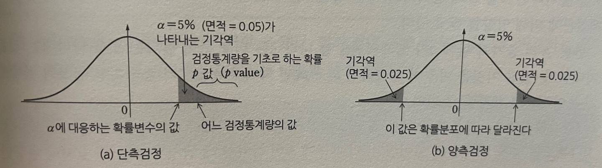

# 데이터 사이언스 교과서

통계(statistic) - 표본을 조사함으로써 모집단의 성질을 명확히 하는 것을 목적으로 하고 개개의 요소를 표본화(샘플링, smapling)하여  
    이것을 분석하고 모집단의 성질을 수량적으로 나타내는 것.

## 1. 통계란

**모집단**(population)의 특징을 나타내는 것이 **모수**(parameter)  
모수는 **모평균**(population mean) μ, **모분산**(population variance) σ2 등 몇 개의 후보가 있음.  

**표본화**(sampling, 표본추출, 샘플링) - 모집단 모두를 아는 것이 불가능한 경우, 이것으로부터 요소를 몇 가지 추출.  
**표본**(sample) - 표본화를 통해 얻어진 것.

**통계**(통계분석) - 이 표본에 대해서 어떠한 분석을 수행하여 모수를 추정하는 것.  
**통계량**(statistic) - 표본으로부터 계산된 수치(표본평균, 표본분산, 표본표준편차 등)

---
---
## 2. 추정
**통계적 추정**(statistical inference) - 표본으로부터 얻어진 통계량을 기초로 모수가 존재하는 범위를 구하는 것.  
1. 점추정 - '모평균이 0.125다'라는 식으로 하나의 값을 추정하는 것.
2. 구간추정 - '모평균은 0.1230과 0.130 사이에 있다.'라는 식으로 범위를 추정하는 것.

### 2.1 점추정(point estimation)
-모집단의 모수를 하나의 값으로 추정하는 방법.

- **불편성** - 추정량[hat(θ)]의 기댓값이 모수 θ에 일치하는 것.  
즉 E[hat(θ)] = θ가 성립할 때 추정량 hat(θ)를 **불편추정량**(unbiased estimator)라고 부른다.  

불편성을 가질 때 θ의 주변에 hat(θ)가 분포한다.  
[실습](https://github.com/Jung-YongHan/Data-Engineering/blob/main/DataScienceTextBook/Part%204_%ED%86%B5%EA%B3%84%EC%9D%98%20%EA%B8%B0%EC%B4%88/practice/practice1.ipynb)

#### **표본분산의 자유도**  
**자유도**(degree of freedom, DoF) - 몇 개의 변수를 마음대로(자유롭게) 움직여도 되는가를 측정하는 지표.   
ex) 표본 $\{x_i\}, (i = 1$ ~ $N)$에 대해, N=1이라고 해도, 표본 평균은 계산할 수 있다.  
즉, N개의 표본을 자유롭게 할 수 있으면 자유도를 N이라고 한다.  

표본분산의 계산식을 생각하면 N = 1에서는 표본분산은 0이 되고 의미를 가지지 않는다.  
최소한 N $\ge$ 2이면, 표본분산은 계산할 수 있다.  
따라서 표본수 중의 하나는 자유롭게 사용할 수 없다. 이 때문에 표본분산의 자유도는 N-1이라고 간주.

#### **일치성**
표본의 수가 증가함에 따라 추정량 hat(θ)에 대응하는 모수에 가까워 지는 것이 바람직.   
이 성질을 나타내는 식,

$\lim_{N \to \infty} P(|\hat{θ}_N - θ| < ε) = 1$  

$N \to \infty$일 때 어느 충분히 작은 양의 수 ε이 있고 $|\hat{θ}_N - θ| < ε$가 되는 확률이 1이 된다는 의미.  
이와 같은 성질을 가질 때 $\hat{θ}$을 일치추정량(consistent estimator)이라고 부름.

이 성질을 가진 것으로 표본평균이 있다.  
표본평균의 분산 -  

$E[(\hat{μ} - μ)^2] = \frac{1}{N}σ^2$  
이것에 의해 $N \to \infty$가 되면 0이 되므로 일치추정량이다.

### 2.2 구간추정(interval estimation)
표본평균이나 표본분산은 모평균이나 모분산 주변에 분포. 각각이 어느 정도의 확률로 해당 분포의 어느 구간에 들어가는 가

**신뢰구간**(confidence interval) - (1 - $\alpha$)의 확률(또는 신뢰도)로 실제 모수의 값 $\theta$가 구간 $[L, U]$에 들어가는 구간이라고 한다.  
$P(L \le \theta \le U) = 1 - \alpha$ 와 같이 표현. => $L, U$를 구하는 것이 주된 목적.  

이때, $L, U$를 각각 **신뢰하한**(lower confidence limit), **신뢰상한**(upper confidence limit),  
(1 - $\alpha$)는 **신뢰도** 또는 **신뢰계수**(confidence coefficient)라고 하고  
구간 $[L, U]$를 100(1 - $\alpha$)% **신뢰구간**(또는 간단히 **신뢰구간**)이라고 부름.

### 2.3 모평균의 신뢰구간
### 2.4 모비율의 신뢰구간
[실습](https://github.com/Jung-YongHan/Data-Engineering/blob/main/DataScienceTextBook/Part%204_%ED%86%B5%EA%B3%84%EC%9D%98%20%EA%B8%B0%EC%B4%88/practice/practice2.ipynb)  

예제의 결과에서 표본조사에 불만을 가지고 있다고 가정하여 개선 방안을 고려하자.  

1. 신뢰도를 95%보다 높이기 위한 방안.  
100% 신뢰구간을 고려하면 모비율 p가 이 사이에 있다는 것을 100% 확실할 수 있지만 구간이 [-$\infty$, $\infty$] 되기 때문에 어떠한 추정값이라도 수용할 수 있다. 즉, 의미없는 생각.

2. $\hat{p}$ = 0.55는 그대로 두어도, 예제의 결과는 신뢰구간이 너무 넓어지므로 이 신뢰구간을 좁히면, $\hat{p}$의 정확도는 더욱 올라가게 된다.  
이를 위해 표본수 N을 크게 하면 된다. 어느 정도 크게 하는가에 대해 생각해보면 아프이 모비율의 신뢰구간을 구하는 문제의 경우 신뢰도 95%의 신뢰 구간의 폭은  2 x 1.96 $\sqrt{\hat{p}(1 - \hat{p})}/\sqrt{N}$이었다.

여기에서 $\hat{p}(1 - \hat{p}) = -\hat{p}^2 + \hat{p} = -(\hat{p} - \frac{1}{2})^2 + \frac{1}{4} \le \frac{1}{4}$이므로  

$\hat{p}(1 - \hat{p})$의 최댓값은 1/4이다. 따라서 신뢰구간의 폭은 넓어져도

2 x $1.96 \sqrt{\frac{1}{4N}}=1.96\frac{1}{\sqrt{N}}$이다.

위 식에서 알 수 있듯이 신뢰구간의 폭을 반으로 줄이려고 하면 표본수는 제곱의 4배가 될 필요가 있다는 것을 알 수 있다.

이 4배의 효과를 확인하기 위해 N = 1000, N = 4000의 경우의 계산 수행 해볼 것.

그럼 $\hat{p}$의 정확도를 더 높이고 싶고, 신뢰구간의 폭을 0.01로 좁히고 싶다고 생각한다고 하자. 앞의 신뢰구간의 최댓값에 관한 식을 이용하여 N = 38416이 된다. 신뢰구간을 0.06에서 0.01로 좁히기 위해서는 표본수를 약 38배로 해야만 한다.

현실에서는 샘플링은 비용이 들기 때문에 통계조사의 정확도와 비용에 양의 상관관계가 있다는 것이 알려져 있다.

---
---
## 3. 가설검정
### 3.1 가설검정이란
**가설검정**(hypothesis testing)이란 어느 가설에 대해서 그것이 옳은가의 여부를 통계학적으로 검증하는 수단.

연구 개발된 신약의 효용성 조사

가설검정에 기초하여 평가에는 다음의 두 가설을 세울 수 있음.

1. 귀무가설(null hypothesis) $H_0$: 약의 효과가 없다
2. 대립가설(alternative hypothesis) $H_1$: 약의 효과가 있다

여기서 어떠한 검정(검증이라고 바꿔 읽어도 된다)을 통해 $H_0$가 틀렸다는 것을 알았다고 하자. 이때 $H_0$을 **기각한다**(reject)라고 판단된다.  
이 경우 $H_1$이 옳은 것으로 **채택**(accept)된다.  

그러나 이 기각이 틀릴 수도 있다. 기각해야 하는 것을 기각하지 않을 수도 있다. 이러한 오류를 위의 예로 말하자면
- 신약의 효용이 있는데도 불구하고 효과가 없다고 판단했다.
- 신약의 효용이 없는데도 불구하고 효과가 있다고 판단했다.

이와 같은 오류를 다음과 같이 표현한다.  
|판단|$H_0$이 옳음|$H_1$이 옳음|
|---|:---:|:---:|
|$H_0$을 기각|제1종의 오류|옳음|
|$H_0$을 기각하지 않음|옳음|제2종의 오류|

일반 데이터(표본)를 잘못 취득한 상황으로 다음과 같은 예를 생각할 수 있다.
- 제1종의 오류 -> 취득해야 하는 데이터를 얻지 못했다(계측기가 일시 정지하여 관측에 실패했다 등)
- 제2종의 오류 -> 취득하지 않아야 할 데이터를 취득했다(회의에서 틀렸어도 목소리가 큰 의견이 통과되었다 등)

귀무가설이 기각되지 않으면 그 존재가 인정되고 '**없던 것으로 되돌아간다**'라는 의미를 나타내는 용어이다.

 

#### **유의수준**(significance level)
-가설검정을 행하는 경우에 귀무가설을 기각하는가의 여부를 판정하는 기준을 말한다.

제1종과 제2종의 오류, 양쪽의 오류를 가능하면 작게 하고 싶지만 유의수준을 작게 해서 귀무가설이 기각되기 어려워지면, 거꾸로 옳지 않는 가설을 수용하는 위험이 증가한다.  

즉 제2종의 오류 확률이 증가한다. 일반적으로 이 양쪽을 동시에 작게 하는 것은 불가능하다.

**[가설검정 절차]**
1. 명제를 세운다.
2. 명제에 적당한 검정통계량을 계산한다.
3. 귀무가설 $H_0$와 이것을 부정하는 대립가설 $H_1$을 세운다.
4. 유의수준 α를 정한다(5%, 1% 등)
5. 이용된 검정통계량이 나타내는 확률분포(표준정규, t, $\mathcal{X}^2$분포 등)로부터 확률 $p$값을 구한다.(검정에서는 p값이라고 부르는 경우가 많다).
6. $p < \alpha$라면, $H_0$가 일어날 확률이 충분히 작다고 판단하여 $H_0$를 기각하고 $H_1$을 채택한다.
7. $p > \alpha$라면, $H_0$을 기각하지 않는다. 표본수, 분석 방법 등을 다시 살펴보고, 재검정을 실시 할 것인가를 고려한다.

### 3.2 단측검정과 양측검정
귀무가설 $H_0$은 '평균 $\mu$ = 2.0이다'라는 식으로 등호를 이용하는 형식으로 설정되는 경우가 많다.   

**단측검정**(one tailed test/one side test) - 이것에 대한 대립가설 $H_1$을 '$\mu > 2.0$' 또는 '$\mu < 2.0$'으로 두는 것  
**양측검정**(two tailed test/two side test) - '$\mu \ne$ 2.0과 같이 두면, $\mu$는 큰지 작은지 어느 것에 포함되는가의 여부를 고려하는 것

대립가설을 특별히 제시하지 않을 때는 대립가설을 양측검정으로 하는 것이 보통이다.

#### **단측검정과 기각역**

위 그림에 나타낸 것처럼 유의수준 $\alpha$ = 5%란 기각역의 면적이 5%(0.05)라는 것이다.  
문제에 적절한 검정통계량을 구하고 이에 대응하는 확률분포를 이용한다.

검정통계량이 기각역(그림에서 진하게 칠해진 부분)에 속하면 $H_0$을 기각, 속하지 않으면 $H_0$을 기각하지 않는다.

판정에는 두 가지 방식이 있다.  
1. $\alpha$에 대응하는 확률 변수의 값(백분위점에 해당하는)을 구하고 검정통계량의 값과 비교한다.
2. 검정통계량을 기초로 확률 $p$를 구해, 이것과 $\alpha$를 비교한다. $\alpha > p$ 값이라면 기각, 반대라면 기각하지 않는다.

(a)는 기각하는 경우를 나타내고 있다. 또한 단측검정의 경우 기각역이 음의 영역에 있는 경우도 있다.

#### **양측검정과 기각역**
$\alpha$값이 동일한 경우를 그림(b)에 나타낸다.

검정통계량이 기각역에 들어가면 $H_0$를 기각, 들어가지 않으면 $H_0$을 기각하지 않는다.

***검정통계량** - 표본데이터에서 계산되어 가설 검정에 사용되는 랜덤 변수

### 3.3 모평균의 검정
표본 $\{x_i\}$, ($i$ = 1 ~ $N$)이 서로 독립이고 정규분포 $N(\mu_0, σ^2$)를 따른다고 가정한다.  
문제는 모집단의 모평균이 $\mu_0$인가의 여부를 검정하는 것이다.(실제 모평균$\mu$는 알지 못한다는 것을 전제)

여기에서 모분산 $σ^2$을 알고 있는 경우와 알지 못하는 경우 각각에 대응하는 검정통계량을 도입.

**[z검정과 t검정]**
- 모분산을 $σ^2$을 알고 있는 경우(z 검정이라고 한다)  
$z = \frac{\hat{\mu} - \mu_0}{σ/\sqrt{N}}$ ~ $N$(0, 1)

- 모분산 $σ^2$을 모르고 있는 경우(t 검정이라고 한다.)  
$t = \frac{\hat{\mu} - \mu_0}{\hat{σ}/\sqrt{N}}$ ~ $t$(N - 1)  
여기에서 좌변의 t는 검정통계량이지만 오른쪽에 있는 t(N-1)은 자유로 N - 1인 분포의 함수를 의미. 좌변의 t는 t(N-1)의 분포를 따른다.

|z|가 크다는 것은 분자가 크든지, 분모가 크든지, 또는 양쪽 모두

분자가 크다는 것은 가정한 $\mu_0와 \mu$의 차이가 크다는 것을 의미하고 기각의 가능성이 높아진다는 것이 자연스러울 것.

분모가 작다는 것은 $σ^2$은 일정하고 표본수 $N$이 크다는 것을 의미한다. <= ?? 통계의 정확도를 높이려면 $N$을 크게 잡아야 한다는 것과 모순이 아닌가

증감률로 보면 $N$은 제곱근에 의해 영향을 받고 있다.

t검정의 경우도, 정성적으로는 z검정과 마찬가지로 볼 수 있다. 다른 점으로는 $N$이 작아지면 t분포는 양쪽 폭이 높고 넓어진다.  
이 때문에 $N$이 작아질 때 검정통계량 t의 오차나 변동만큼 다소 영향이 커지더라도 z검정 때보다도 기각하는 확률을 줄이려는 견해가 있다.

[실습]()

### 3.4 모분산의 검정
표본 $\{x_i\}$, ($i$ = 1 ~ $N$)이 서로 독립이고 정규분포 $N(\mu, σ^2$)를 따른다고 가정한다. 이 $\mu, σ^2$  양쪽 모두 알지 못한다.  
이 때 모분산이 가정하는 $σ_0^2$와 동일한가의 여부를 검정하는 것이 모분산의 검정이다.

이를 위해 다음의 검정통계량을 이용한다.

**[모분산의 검정]**

$\mathcal{X}^2 = \frac{N-1}{σ_0^2}\hat{σ^2}$ ~ $\mathcal{X}^2$(N - 1)

표본분산 $\hat{σ^2}$은 불편이고($N$ - 1)로 나눈 것), 또한 좌변의 $\mathcal{X}^2$은 검정통계량을 나타내고, 오른쪽 위의 2는 단순한 표기에 불과하다.

한편, 우변의 $\mathcal{X}^2(N - 1)$은 자유도 $(N - 1)$인 카이제곱분포 함수이다.  
좌변의 검정통계량 $\mathcal{X}^2$은 $\mathcal{X}^2$의 분포를 따르는 것을 알고 있다. 

[실습]()

### 3.5 두 표본의 평균 차이에 대한 검정(pass)
두 모분산을 모두 알지 못하는 경우에는 웰치의 t검정을 이용

### 3.6 상관, 무상관의 검정
샘플수 N이 2인 두 가지 데이터 x와 y 사이의 관계를 **상관**(correlation)이라고 한다. 산점도를 보고, 이 상관의 강약을 정량적으로 측정한 것으로 **상관계수**(correlation coefficient)

$\hat{p_{xy}} = \frac{\sum_{i=1}^N (x_i - \hat{\mu_x})(y_i - \hat{\mu_y})}{\sqrt{\sum_{i=1}^N(x_i - \hat{\mu_x})^2}\sqrt{\sum_{i=1}^N(y_i - \hat{\mu_y})^2}}$

 여기세어 $\hat{\mu_x}, \hat{\mu_y}$는 각각 $\{x_i\}, \{y_i\}$의 표본평균이다.  
 상관관계는 반드시 $-1 \le \hat{p_{xy}} \le 1$의 범위에 있다.

$\hat{p_{xy}}$ > 0 일 때 **양의 상관**, $\hat{p_{xy}}$ <0일 때 **음의 상관**, $\hat{p_{xy}} \approx$ 0일 때 **무상관**(uncorrelated)이라고 한다.

상관관계의 절댓값 |$\hat{p_{xy}}$|가 커질수록, 상관이 강해진다는 것이 일반적인 해석이지만  
|$\hat{p_{xy}}$|가 얼마일 때 강하다, 중간정도이다, 약하다는 기준은 정해져 있지 않고, 대상에 따라 기준을 정하는 경우가 많다.  

또한 경험상 N < 1 정도일 때 $\hat{p_{xy}}$ = 0.7 정도에서도 실제로는 상당히 약한 상관인 경우가 있다.  
따라서 상관계수의 숫자만으로 판단하는 것이 아닌, 산점도를 그려 확인하는 것이 필요하다.

#### **무상관 검정**
상관계수의 숫자를 보는 것만으로 상관이 있는가의 여부를 바로 판정하는 것은 위험.  
따라서 상관이 있는가의 여부를 검정하는 무상관 검정이 있음.

이것은 무상관이라면 모상관계수는 $p_{xy}$ = 0이 될 것이다. 이 검정을 수행하기 위해 다음의 검정통계량을 도입한다.

t = $\frac{|\hat{p_{xy}}|\sqrt{N - 2}}{\sqrt{1 - \hat{p_{xy}}^2}}$ ~ t $(N - 2)$

[실습]()