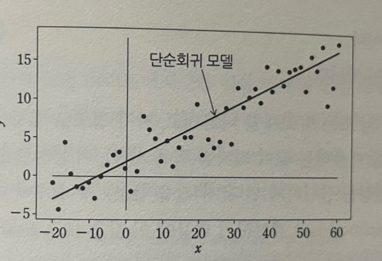

# 데이터사이언스 교과서
## 1. 회귀분석이란
### 1.1 회귀의 유래
***회귀** - 한 바퀴 돌아 원래대로 돌아간다는 것  
**회귀분석**(regression analysis)에서 회귀란 용어를 최초로 도입한 사람은 Sir F.Galton(영국, 통계학자)로 알려져 있음  

아버지와 아들의 신장 상관관계를 1차식으로 이용하여 조사한 결과, 세대를 걸쳐 평균값에 수렴하는 것을 발견.  
이것을 평균회귀(regression toward the mean)라고 부른 것이 발단.
현재의 회귀분석은 이 회귀의 의미를 확장한 것.

### 1.2 시스템 이론에서 본 회귀분석

그림에서 시스템이란 설명 변수가 입력되어 주어질 때 목적변수가 출력되어 나타나는 것.

시스템의 구조는 물리적 고찰 또는 경험규칙에 의해 어떤 수학 모델에 근사할 수 있는 것으로 한다. 이것이 그림에서 나타난 회귀모델.

회귀 모델의 차수를 이미 알고 있다고 가정하여 이 파라미터(수학 모델의 계수)를 구하면 시스템을 근사할 수 있는 모델이 얻어지게 됨.  
오차 $e = y - \hat{y}$을 어떠한 기준으로 측정한 뒤, 최소하를 목표로 하는 것이 자주 이용됨.

회귀 모델을 구하는 것은 파라미터를 구하는 것을 의미.

모델은 선형이라고 가정할 수 있을 때 다음과 같이 나타낸다.  
$y = x\beta^T =\beta_0 + \beta_1x + ... + \beta_px_p$ 

여기에서 p는 모델의 차수로 다음과 같이 둔다.

$x = [ 1 , x_1, ... , x_p]$  
$\beta = [ \beta_0 , \beta_1, ... , \beta_p]$

회귀분석 분야에서 $\beta$는 편회귀계수(partial regression coefficient)라고 부른다.  
특히 상수은 $\beta_0$를 편향된 파라미터라고 부르고, 중요시하는 경우도 있다. 이 때문에 이 항을 골라낸 다음 표현도 자주 이용.  
$y = \beta_0 + x\beta^T$  

모델이 비선형이라면 다음과 같이 나타낸다.  
$y = f(x, \beta)$

선형,비선형에 상관없이, 회귀분석이란 다음을 수행하는 것이다.  

- 모델 구조를 이미 알고 있다고 가정하고 모델 차수 $p$를 선택한다
- $x, y$를 이용하여 편회귀계수 $\beta$를 추정하고 회귀 모델을 구한다.
- 이 회귀 모델을 이용하여 목적변수를 알지 못하는 경우 새로운 설명 변수를 모델에 입력(투입)하여 목적변수를 예측.

---
---

## 2. 단순회귀분석
단순회귀분석(simple linear regression)은 $y = \beta_0 + \beta_1x$인 1차식을 다룬다. 이것을 단순회귀 모델이라고 한다.

단순회귀분석이란 얻어진 표본(데이터)에서 편회귀계수를 추정하여 모델을 구한 뒤에 이 모델을 이용하여 예측하는 것이다.
### 2.1 단순회귀분석의 의의

산점도에서 둥근점은 어떠한 관측을 기반으로 측정된 값.
이때, x는 설명변수, y는 목적변수.

이제 $x$와 $y$의 관계가 1차식으로 표현된다고 가정하고 다음의 단순회귀 모델을 도입.  
$y = \beta_0 + \beta_1x$

이 모델이 관측된 데이터에 가장 잘 적합하도록 편회귀계수를 구한다.  
이것은 수치계산의 적합이라고 부르는 문제에 속하고 보통은 최소제곱 문제로 다루어진다.

단순회귀모델이 얻어지고 이것을 직선으로 그린것이 위 그림이다.  
이 단순회귀 모델은 수식(연속값을 취하고 $-\infty, +\infty$의 구간에 자리잡는)으로 표현되고 다음과 같은 의미를 갖는다.

- 측정된 데이터는 이산값이다. 이 때문에 서로 인접한 데이터 사이의 y를 알고싶은 경우에 이 값을 예측할 수 있다.
- 이 예에서는 $-20 \le x_i \le 60$이다. 이 구간을 넘어선 $y$를 예측하는 것도 가능하다.
- 절편항 $\beta_0$, 기울기 $\beta_1$을 살펴보면 설명 변수를 기반으로 하는 목적변수의 생성 메커니즘을 추정하는 단서를 얻을 수 있다.

### 2.2 단순회귀 모델의 통계적 평가
첫번째 그림에서 오차 $e$는 이산 시계열 데이터{$e_i$}, ($i = 1$ ~ $N$)이고 확률 변수로 두는 경우가 많다.

이 전제를 세울 때 단순회귀 모델은 확률 시스템이 되고 모델의 좋고 나쁨은 통계적 평가를 거치게 된다.
 
 

**편회귀계수의 t검정**  
단순회귀 모델이 확률시스템이라는 가정 아래, 편회귀계수는 확률 변수가 되고, 표본마다 그 값이 변한다.  
특히 계수 $\beta_0, \beta_1$의 값이 0인가의 여부를 문제로 하고 싶은 경우가 있다.

(ex, $y$ = 점포의 매출, $\beta_0$ = 고정비, $\beta_1$ = 단가, $x$ = 판매 수량이라고 할 때 $\beta_0 = 0$ 또는 $\beta_1 = 0$이라는 계산 결과가 얻어지면, 이것은 현실적이지 않기 때문에 통계 데이터의 품질이 나쁘다고 판단하여 통계를 다시 내도록 요구할 수 있다.)

이때 다음 가설검정을 실시.

$H_0$ : 계수는 0이다.  
$H_1$ : 계수는 0이 아니다.

여기에서 계수는 $\beta_0$ 또는 $\beta_1$ 모두를 나타내고, 각각 별도로 검정을 실시.  
각 계수에 관한 검정은 $e_i$의 분산을 이용하는 것이 되지만, 이 분산은 알지 못한다. 이 때문에 표본분산을 이용한 t 검정을 실시

각 계수에 대한 t 검정통계량과 이것에 수반되는 값은 statsmodels이 계산하기 때문에 이 값을 보고 $H_0$을 기각할지의 여부를 판단할 수 있다.

**결정계수**(coefficient of determination)  
$R^2$로 표현하고(위첨자 2는 단순히 표기에 불과), 회귀 모델의 데이터에 대해서 적합한 정도를 나타내는 지표로 statsmodels가 계산.  
결정계수는 다음 범위를 취하는 것으로 알려져 있다.

$0 < R^2 \le 1$

이 식이 1에 가까울 수록 잘 적합되었다고 판단하고 설명 변수가 목적변수를 잘 설명하고 있다고 말한다.  
일반적으로 자주 언급되지만 $R^2$이 0.6이하라면 좋지 않지만 0.8이상이라면 어느 정도 좋은 모델이라고 판단. 그러나 절대적 평가X

위 그림을 보면 (a)의 사례는 데이터의 분포에서는 납득할 수 있다.

(b)의 사례에서 점선으로 둘러싼 데이터 군의 영향에 의해 $R_A^2 < R_B^2$가 되었을 것이다. 그러나 겉보기로는 단순회귀 모델 A 쪽이 더 좋다고 볼 수 있다.

결국 어떠한 모델이 좋은가의 판단은 $R^2$만으로는 결정될 수 없다. 데이터의 배경이나 사용 조건에 좌우되며 절대적인 지표가 아니라 기준이라는 것으로 인식.

### 2.3 가계 동향 조사
2인이상 세대의 연간 수입에 대해, 1개월당 지출과 엥겔계수 각각에 대한 단순회귀분석을 실시.  
[실습](https://github.com/Jung-YongHan/Data-Engineering/blob/main/DataScienceTextBook/Part%205_%ED%9A%8C%EA%B7%80%20%EB%B6%84%EC%84%9D/practice/practice1.ipynb)

### 2.4 심슨의 역설
데이터 가시화도 포함하여 몇 가지 통계량을 살펴보고 나서 회귀분석을 실시한 뒤에 사전분석과 대조하여 확인한 후 결과를 평가하는 것이 바람직하다.  
이것을 게을리하여 잘못을 범하는 대표적인 예로 통계학에서 유명한 심슨의 역설(Simpson's paradox)이 있다.

이것은 모집단의 상관과 부분집단의 상관이 다른 경우가 있고 부분집단에서의 가설이나 통계분석 결과가 모집단과는 정반대의 결과가 나오는 것을 지적.

### 2.5 수학적 설명
**불편추정량:** $E[\hat{\beta_0}] = \beta_0$, $~~E[\hat{\beta_1}] = \beta_1$  

**일치추정량:** $N \to \infty$일 대 아래 계수의 분산은 0에 가까워진다.

## 3. 다항식회귀분석
관측 데이터가 다항식에 가까운 분포를 나타낼 때 단순회귀 모델보다 다항식 모델을 이용한 적합 쪽이 바람직함.

## 4. 중회귀분석
p차 회귀모델(p>=2)을 이용. 즉, 설명변수가 여러 개.